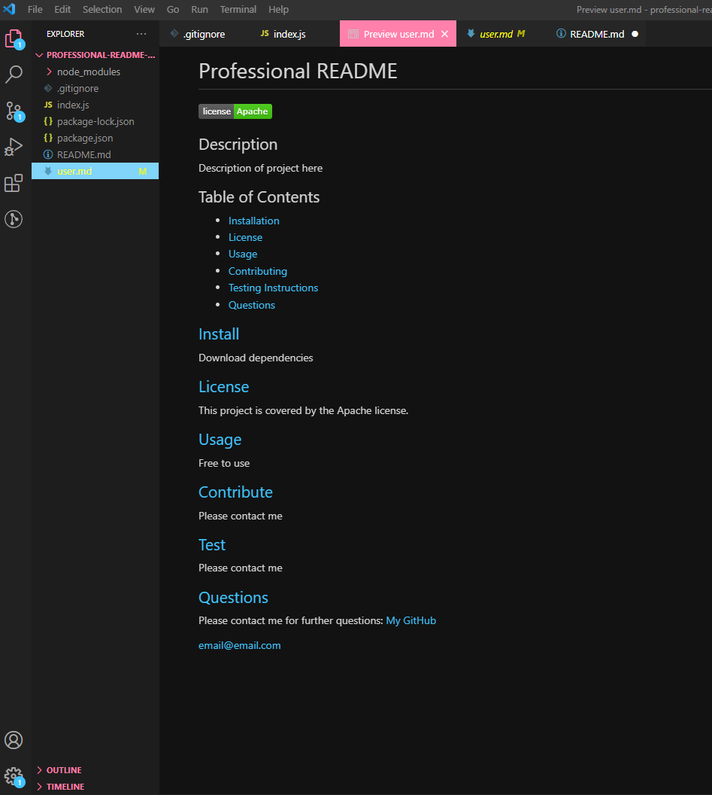

# professional-readme-generator

## Description
With this program you will no longer have to write your own READMEs! Using Inquirer.prompt, a user will be asked to input information regarding their project. It will then generate a Markdown file. A current known bug is that the table of contents' links do not move to the corresponding section.

## Installation

Run npm install to download any dependencies before running.

## Usage

Free to use.

## Images
Watch a video:
<a href="https://drive.google.com/file/d/1V91X3IuUibDg2YHjW0UFR0P9-Qiex2Bn/view" target ="_blank">Link to Google Drive Video</a>

Image of generated Example README:

## Future Development

Simplify the GitHub profile input. Instead of asking a user for their GitHub profile URL, the user will input their GitHub username and the program will find their profile and link it in the README.